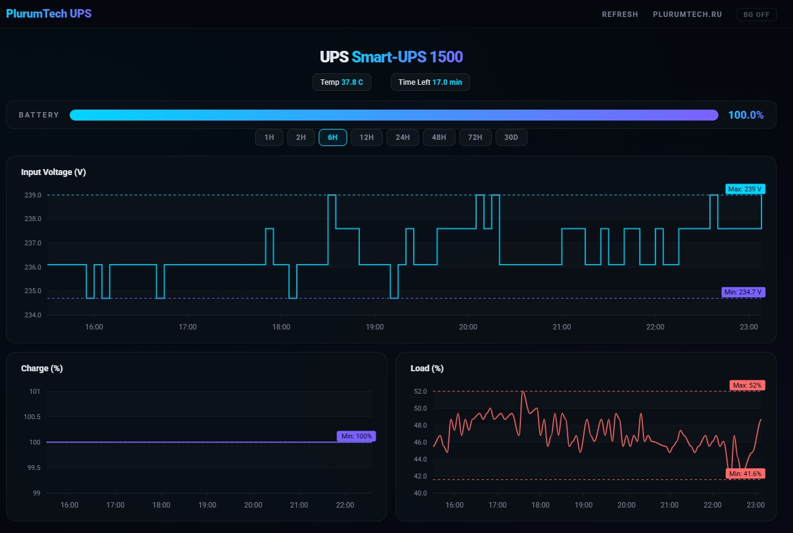

# Pt UPS Monitor



APC Smart-UPS monitoring stack — real-time dashboard, historical data collector, and Zabbix
integration for APC Smart-UPS 750/1000/1500/2200/3000 and other models supported by `apcupsd`.
Monitors input voltage, battery charge, UPS load, temperature, and remaining runtime.
Works with the `apcupsd` NUT-compatible daemon on Linux servers.

**Use case**: server room UPS monitoring, home lab power tracking, data center APC Smart-UPS
supervision via SNMP-less lightweight agent.

## Components

| File | Description |
|---|---|
| `apcups_collector_mysql.pl` | Collector — reads `apcupsd.status`, stores to MySQL |
| `apcups_ui.pl` | Web dashboard — ApexCharts, PlurumTech dark theme |
| `apcups_ui.sql` | Database schema (`ups_data` + `current_status`) |
| `apcupsd_zabbix_template_agent.yaml` | Zabbix template (import) |
| `zabbix_agent_apcupsd.conf` | Zabbix agent UserParameters |
| `install.sh` | Installer — RHEL & Debian/Ubuntu |

## Features

- **Real-time dashboard** — ApexCharts, PlurumTech dark theme, synchronized time axis
- **Historical data** — MySQL/MariaDB storage, configurable retention
- **Zabbix integration** — ready-to-import template + agent UserParameters
- **Battery monitoring** — charge %, estimated runtime, temperature
- **Power quality** — input voltage tracking with min/max annotations
- **Load monitoring** — UPS load percentage over time
- **Shutdown automation** — graceful server shutdown on low battery
- **Cross-platform** — installer supports RHEL 8/9, Rocky Linux, CentOS, Debian, Ubuntu

## Quick Start

```bash
sudo bash install.sh
```

## Requirements

| Component | RHEL/CentOS/Rocky | Debian/Ubuntu |
|---|---|---|
| Perl | `perl` | `perl` |
| DBI | `perl-DBI` | `libdbi-perl` |
| DBD::mysql | `perl-DBD-MySQL` | `libdbd-mysql-perl` |
| Apache | `httpd` | `apache2` |
| MySQL/MariaDB | `mariadb-server` | `mariadb-server` |
| apcupsd | `apcupsd` | `apcupsd` |
| Zabbix agent | `zabbix-agent` | `zabbix-agent` |

Installer handles: dependency detection, apcupsd verification, MySQL setup, Apache vhost, cron.

## License

GNU GPL v3 — [PlurumTech.com](https://plurumtech.com)
